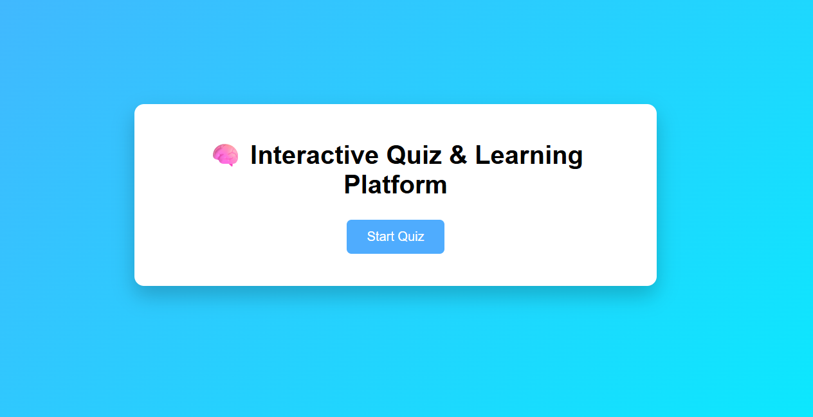
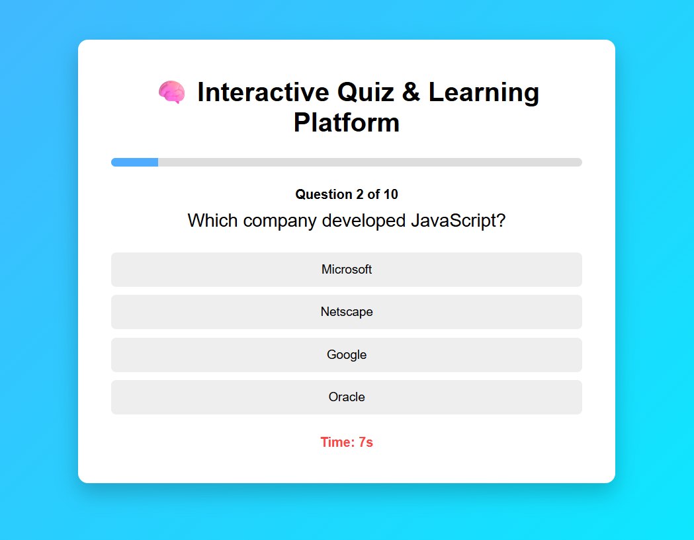
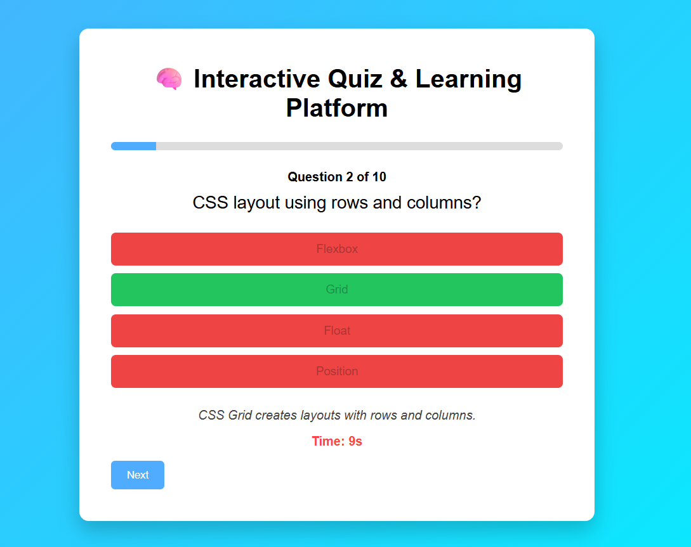
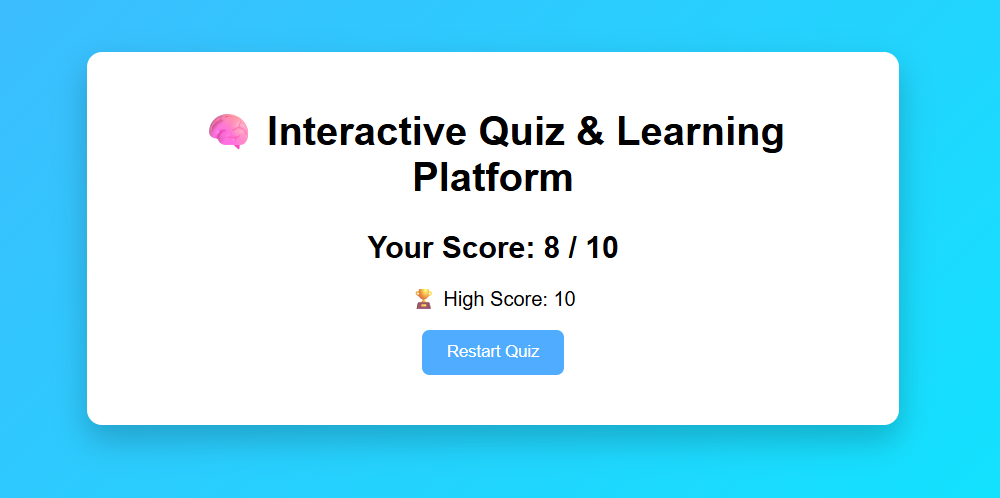

# Interactive Quiz & Learning Platform

## Features

- Start quiz screen
- 10 multiple choice questions
- Question timer
- Quiz progress bar
- Answer highlighting (correct and incorrect)
- Explanation after each question
- Score calculation
- High score leaderboard using LocalStorage
- Restart quiz functionality
- Clean responsive UI

## Technologies Used

- HTML5
- CSS3
- JavaScript (Vanilla JS)
- LocalStorage API

## Folder Structure

interactive-quiz-learning-platform
│
├── index.html
├── styles.css
├── script.js
├── README.md
└── screenshots
    ├── start-screen.png
    ├── quiz-question.png
    ├── answer-highlight.png
    └── result-screen.png

## Screenshots

### Start Screen

### Quiz Question

### Answer Highlight

### Result Screen

